<div align="center">
  
  
</div>

<br/>

<p align="center">
  
</p>

<p align="center">
  <a href="https://linkedin.com/in/anish-shirodkar">
    
  </a>
  &nbsp;
  <a href="https://anishshirodkar.me">
    
  </a>
  &nbsp;
  <a href="mailto:shirodkaranish3@gmail.com">
    
  </a>
  &nbsp;
  
</p>

<br/>

---

## ⚡ About Me

I build AI systems that go beyond demos — **production-grade retrieval pipelines, LLM agents, and CV systems** shipped end-to-end.

My focus is on **information retrieval and LLM engineering**. My latest semantic search system achieves **NDCG@10 of 0.692** on MS MARCO — **143% above the BM25 baseline**.

```text
🎓  MS Computer Science (AI & ML Track) — Rutgers University
🔬  Research: Neural ranking, efficient retrieval, LLM agent systems
🏆  Ranked 2nd in B.Tech IoT batch — CGPA 9.50/10
📜  Government Copyright — Attention-LSTM weather forecasting system (IP India, 2025)
🚀  Open to: Summer 2026 AI/ML Engineering Internships
```


## 🔬 What I Build

> Each project goes from research or problem definition through model development to production deployment.

<br/>

| &nbsp; | System | What it does | Stack |
|:---:|---|---|---|
| 🔍 | **[Semantic Search](https://github.com/Anish0104/semantic-search)** | Two-stage retrieval: bi-encoder retrieves 100 candidates, cross-encoder reranks to top 10. **NDCG@10: 0.692 — +143% over BM25** | `sentence-transformers` `Qdrant` `FastAPI` `Docker` |
| 🧠 | **[SkillGap AI](https://github.com/Anish0104/SkillGap)** | Extracts skill entities from resumes + JDs, ranks gaps, runs a stateful multi-turn AI interview grounded to your actual experience | `Gemini 2.5 Flash` `Next.js 15` `Supabase` |
| 🔐 | **[Vouch](https://github.com/Anish0104/vouch)** | Trust delegation layer for multi-agent AI — agents act on your behalf with scoped credentials, zero raw token exposure | `Auth0 Token Vault` `LLaMA 3.3 70B` `React` `Express` |
| 📈 | **[QuantVision](https://github.com/Anish0104/QuantVision)** | PPO agent trained on custom Gymnasium env; evaluated on Sharpe Ratio, Sortino Ratio, Max Drawdown across 2008/2020/2022 crash regimes | `Stable-Baselines3` `FastAPI` `Next.js` |
| 🚗 | **[Vtrack](https://github.com/Anish0104/Vtrack-Traffic_Analysis_System)** | Real-time multi-vehicle detection, tracking, and speed estimation on live video | `YOLOv8` `ByteTrack` `OpenCV` |
| 📄 | **[DocPilot](https://github.com/Anish0104/DocPilot)** | RAG pipeline for document Q&A — query your PDFs with LLaMA 3.1 backed by ChromaDB | `LLaMA 3.1` `ChromaDB` `Streamlit` |


## 🛠️ Tech Stack

**AI & Machine Learning**


**NLP, Retrieval & GenAI**


**Engineering & Infrastructure**


## 📊 GitHub Stats

<p align="center">
  
  &nbsp;&nbsp;
  
</p>

<p align="center">
  
</p>

<p align="center">
  
</p>

<p align="center">
  
</p>


## 🏆 Research & Recognition

<table>
  <tr>
    <td>📜</td>
    <td><b>Government Copyright</b> — Attention-LSTM weather forecasting system registered with IP India (No. LD-20250175526, 2025), built for the Indian Meteorological Department</td>
  </tr>
  <tr>
    <td>🧪</td>
    <td><b>GSoC 2026 Applicant</b> — Submitted proposals for OLMo-7B LLM integration into DeepChem (<a href="https://github.com/deepchem/deepchem/pull/4876">PR #4876</a>) and probabilistic weather forecasting for MLLAM</td>
  </tr>
  <tr>
    <td>🎓</td>
    <td><b>Ranked 2nd</b> in B.Tech IoT batch — Thakur College of Engineering & Technology, Mumbai (CGPA: 9.50/10)</td>
  </tr>
</table>


## 📍 Currently

- 🔭 **Exploring:** Late interaction retrieval (ColBERT) and inference optimization techniques
- 📖 **Reading:** Recent papers on neural ranking and efficient transformer architectures
- 💬 **Ask me about:** RAG systems, two-stage retrieval, LLM agents, or getting ML projects production-ready

<br/>




